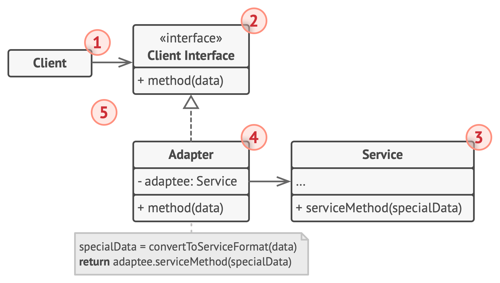
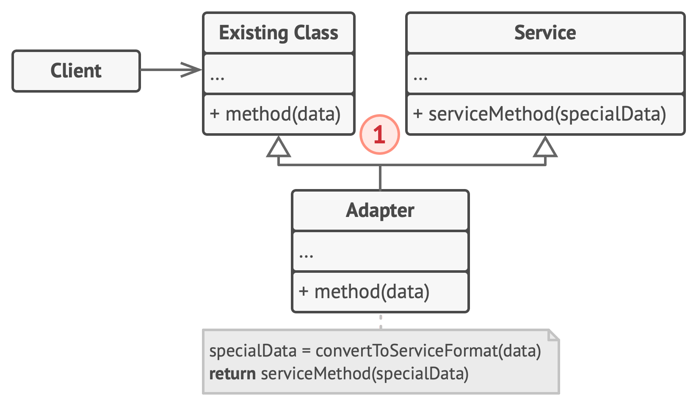

## 适配器模式

## 对象适配器
实现时使用了构成原则: 适配器实现了其中一个对象的接口， 并对另一个对象进行封装。 所有流行的编程语言都可以实现 适配器。

1. 客户端(Client)是包含当前程序业务逻辑的类。
2. 客户端接口(Client Interface)描述了其他类与客户端代码
合作时必须遵循的协议。
3. 服务(Service)中有一些功能类(通常来自第三方或遗留系 统)。 客户端与其接口不兼容， 因此无法直接调用其功能。
4. 适配器(Adapter)是一个可以同时与客户端和服务交互的 类: 它在实现客户端接口的同时封装了服务对象。 适配器接 受客户端通过适配器接口发起的调用， 并将其转换为适用于 被封装服务对象的调用。
5. 客户端代码只需通过接口与适配器交互即可， 无需与具体的 适配器类耦合。 因此， 你可以向程序中添加新类型的适配器 而无需修改已有代码。 这在服务类的接口被更改或替换时很 有用: 你无需修改客户端代码就可以创建新的适配器类。

## 类适配器

这一实现使用了继承机制: 适配器同时继承两个对象的接口。 请注意， 这种方式仅能在支持多重继承的编程语言中实现， 例如 C++。
1. 类适配器不需要封装任何对象， 因为它同时继承了客户端和 服务的行为。 适配功能在重写的方法中完成。 最后生成的适 配器可替代已有的客户端类进行使用。
