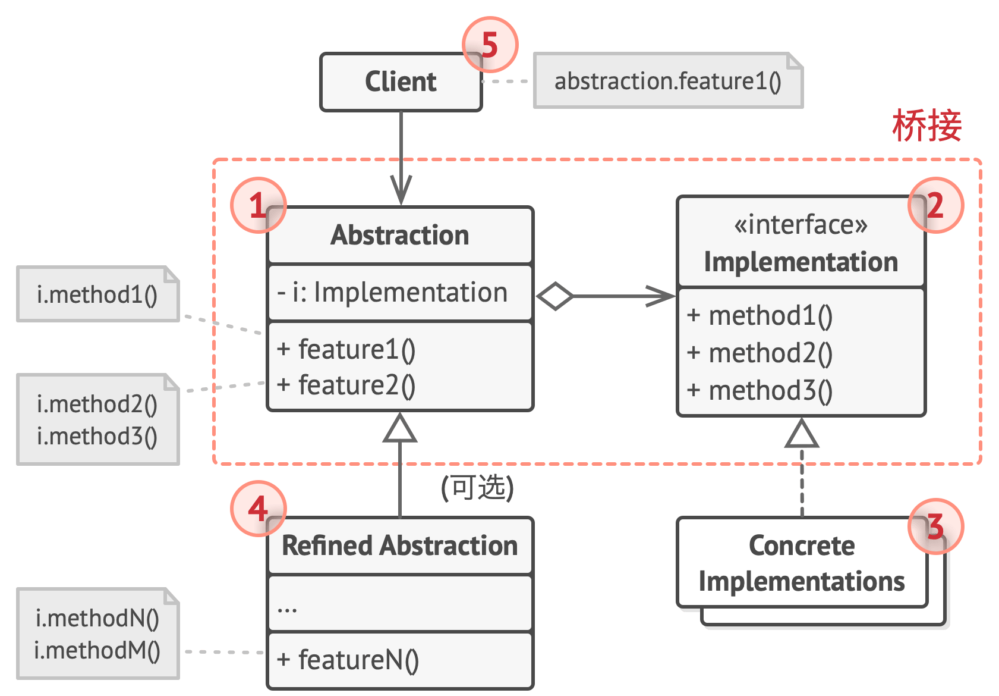

## 桥接模式

## 结构

1. 抽象部分(Abstraction)提供高层控制逻辑，依赖于完成底 层实际工作的实现对象。
2. 实现部分(Implementation)为所有具体实现声明通用接口。 抽象部分仅能通过在这里声明的方法与实现对象交互。
抽象部分可以列出和实现部分一样的方法， 但是抽象部分通 常声明一些复杂行为， 这些行为依赖于多种由实现部分声明 的原语操作。
3. 具体实现(Concrete Implementations)中包括特定于平台的 代码。
4. 精确抽象(Refined Abstraction)提供控制逻辑的变体。与其 父类一样， 它们通过通用实现接口与不同的实现进行交互。
5. 通常情况下，客户端(Client)仅关心如何与抽象部分合作。 但是， 客户端需要将抽象对象与一个实现对象连接起来。
