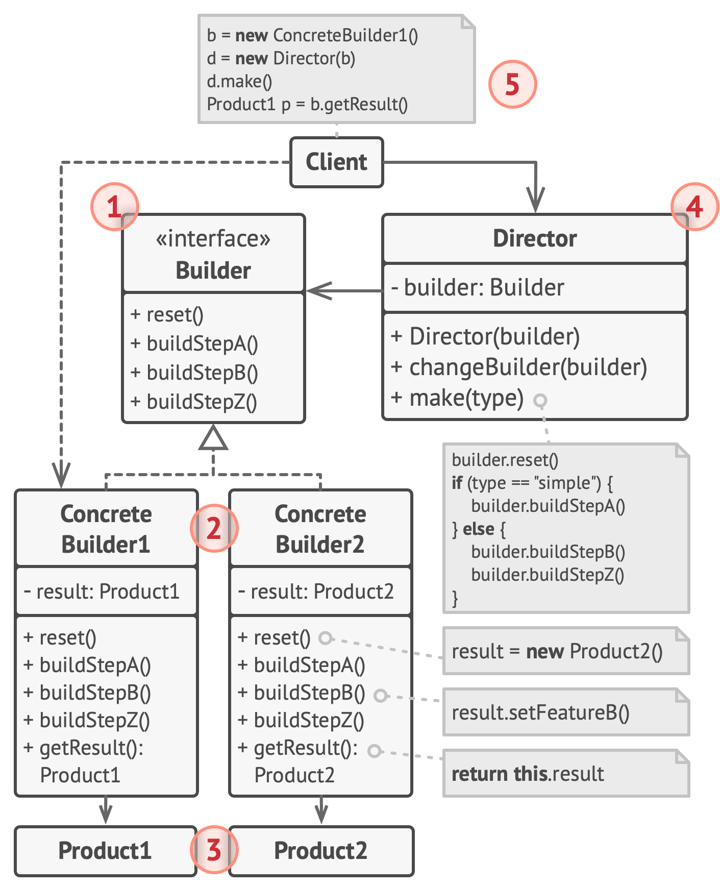

##  生成器模式结构

1. 生成器(Builder)接口声明在所有类型生成器中通用的产品 构造步骤。
2. 具体生成器(Concrete Builders)提供构造过程的不同实现。
  具体生成器也可以构造不遵循通用接口的产品。
3. 产品(Products)是最终生成的对象。由不同生成器构造的 产品无需属于同一类层次结构或接口。
4. 主管(Director)类定义调用构造步骤的顺序，这样你就可以 创建和复用特定的产品配置。
5. 客户端(Client)必须将某个生成器对象与主管类关联。一 般情况下， 你只需通过主管类构造函数的参数进行一次性关 联即可。 此后主管类就能使用生成器对象完成后续所有的构 造任务。 但在客户端将生成器对象传递给主管类制造方法时 还有另一种方式。 在这种情况下， 你在使用主管类生产产品 时每次都可以使用不同的生成器。