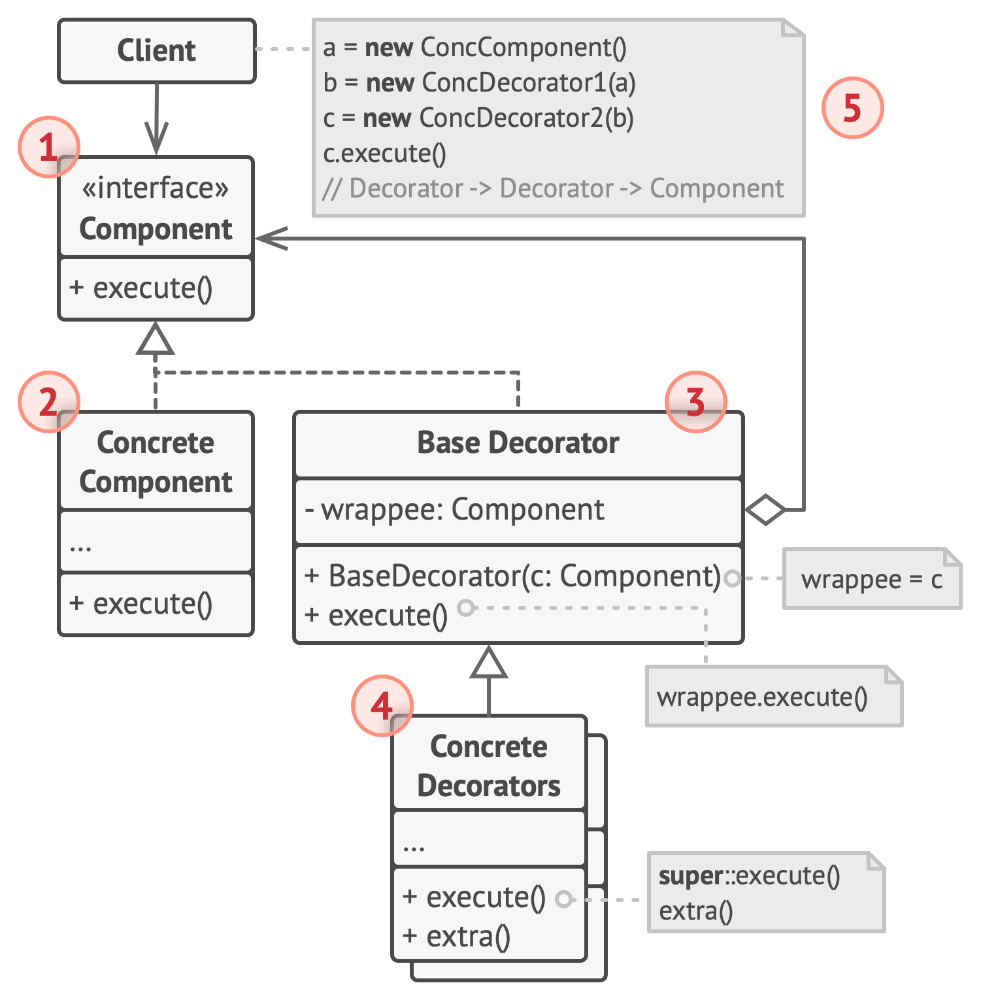

## 结构

1. 部件(Component)声明封装器和被封装对象的公用接口。
2. 具体部件(Concrete Component)类是被封装对象所属的类。
它定义了基础行为， 但装饰类可以改变这些行为。
3. 基础装饰(Base Decorator)类拥有一个指向被封装对象的引 用成员变量。 该变量的类型应当被声明为通用部件接口， 这 样它就可以引用具体的部件和装饰。 装饰基类会将所有操作 委派给被封装的对象。
4. 具体装饰类(Concrete Decorators)定义了可动态添加到部 件的额外行为。 具体装饰类会重写装饰基类的方法， 并在调 用父类方法之前或之后进行额外的行为。
5. 客户端(Client)可以使用多层装饰来封装部件，只要它能 使用通用接口与所有对象互动即可。
