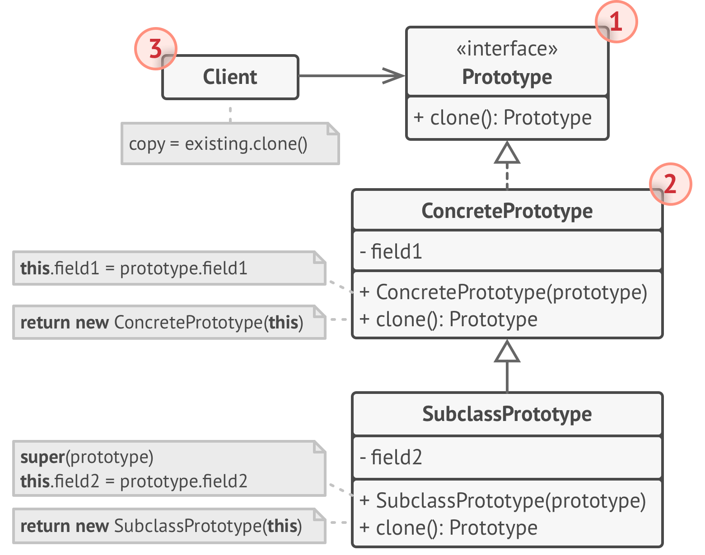
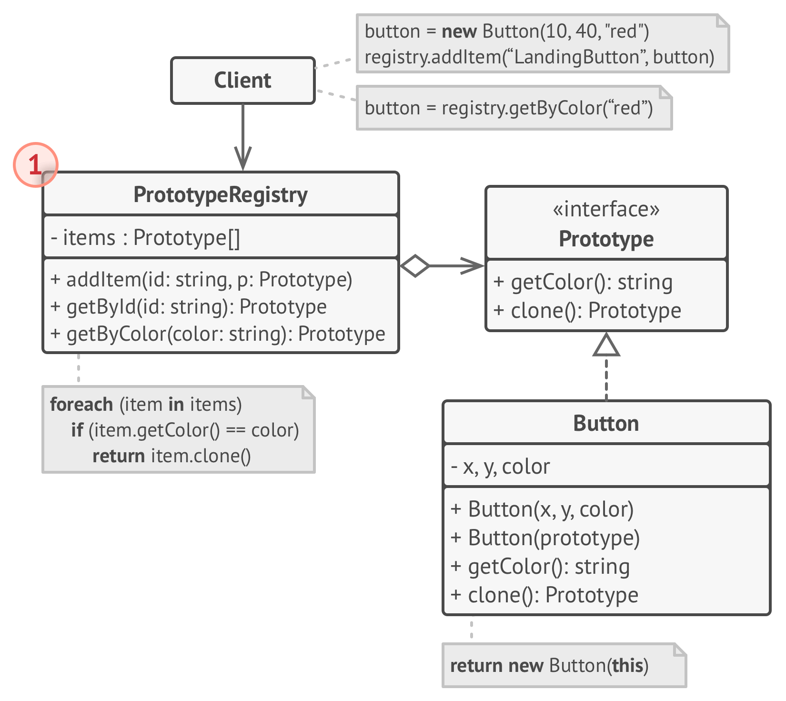

## 原型模式

## 基本实现

1. 原型(Prototype)接口将对克隆方法进行声明。在绝大多数 情况下， 其中只会有一个名为 clone 克隆 的方法。
2. 具体原型(Concrete Prototype)类将实现克隆方法。除了将 原始对象的数据复制到克隆体中之外， 该方法有时还需处理 克隆过程中的极端情况， 例如克隆关联对象和梳理递归依赖 等等。
3. 客户端(Client)可以复制实现了原型接口的任何对象。

## 原型注册表实现
  

1. 原型注册表(Prototype Registry)提供了一种访问常用原型 的简单方法， 其中存储了一系列可供随时复制的预生成对象。 最简单的注册表原型是一个 名称→原型 的哈希表。但如 果需要使用名称以外的条件进行搜索， 你可以创建更加完善 的注册表版本。